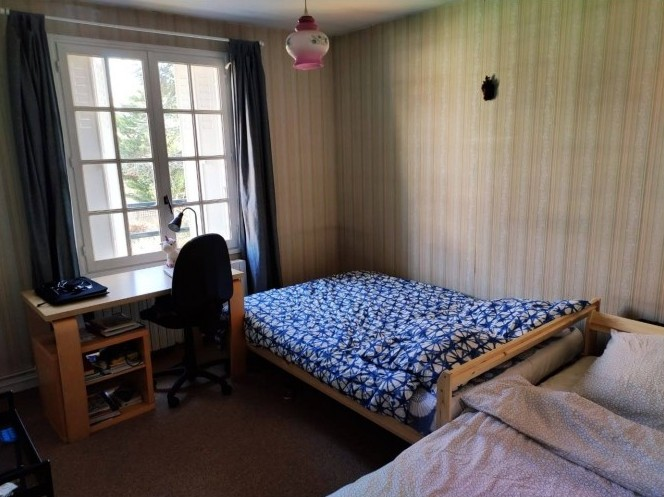

# Getting Started

Connect, Explore, Thrive: Your Ultimate Guide for Studying in France as International Student.

### As soon as possible

Before you arrive in France, start looking for [accommodation](https://www.campusfrance.org/en/student-housing-france) as soon as possible. You can complete some procedures from abroad. If you are planning on looking for lodging when you arrive in France, remember to reserve temporary lodging until you can find somewhere permanent.

<center>
  <figure>
    
    <figcaption>
      <small>
        Villejuif Sharing Room
      </small>
    </figcaption>
  </figure>
</center>

### One month before your departure

If you are not a European Union national, complete the procedures to [obtain your visa](https://www.campusfrance.org/en/the-different-types-of-visas) at least one month before your arrival in France. You can submit your request to the French Consulate or Embassy in your country of residence as soon as you receive proof of acceptance from your institute.

### One week before your departure

<ol>
  <li>Inform your host institute and your landlord, if you have one, of your arrival. Some universities offer airport pick-up service.</li>
  <li>Pack your bags, making sure to take clothing adapted to all types of weather.</li> 
  <br/>
  <table>
  <thead>
    <tr>
    <td>Item</td>
    <td>⭐</td>
    <td>Description</td>
    </tr>
  </thead>
  <tbody>
    <tr>
      <td>Bags</td>
      <td>🛄</td>
      <td>Suitcase, laptop bag, sidebag or travel bagpack to carry your essentials.</td>
    </tr>
    <tr>
      <td>Glasses</td>
      <td>😎</td>
      <td>Laptop glass and Sunglass to bring out your madlad vibes .</td>
    </tr>
    <tr>
      <td>Cooking gear</td>
      <td>🍽</td>
      <td>Lunch box, spoon, fork, pocket knife, scissor and some cooking utensils. Spices of your choice.</td>
    </tr>
    <tr>
      <td>Hygiene materials</td>
      <td>🧼</td>
      <td> Soap, shampoo, towel, toothpaste & brush, razor/shaver, hair trimmer, lipcare, body lotion, body powder.</td>
    </tr>
    <tr>
      <td>Medicines</td>
      <td>🍶</td>
      <td>Some basic medicines before you get health insurance.  *Eg. paracetamols*</td>
    </tr>
    <tr>
      <td>Clothes</td>
      <td>👚</td>
      <td> Basic summer and winter wears, inner wears. *Eg. muffler, gloves as it gets cold in winter*</td>
    </tr>
    <tr>
      <td>Money</td>
      <td>💸</td>
      <td> If possible some cash (Euro) along with you.</td>
    </tr>

  </tbody>
  </table>

  <li>Finally, prepare the documents you will need for your trip and for setting up, meaning:</li>
</ol>
  
  **<u>Identity documents</u>** :
  ```
  - Identity card
  - Passport
  - Birth certificate (French translated and certified copy [VERY IMPORTANT !!])
  - Driving licence (if you are planning on driving in France).
  ```

**<u>Documents relating to your studies in France:</u>** :

```
- Proof of enrolment in your institute
- Proof of language ability (French, English, etc.)
- Previous degrees (a translated and certified copy).
```

**<u>Documents relating to your trip</u>** :

```
- Your train or plane tickets
- Your itinerary from the airport.
```

**<u>Documents relating to setting up</u>** :

```
- Printed reservation of your accommodation
- Documents required for taking up residence in the lodging
- List and contact information for your contacts in France.
```

:::tip
Don't hesitate to scan or photograph your documents and email them to yourself or save them in the Cloud. You will then always have easy access to them.
:::
